# Introdução

Esse projeto é um exemplo prático de como desenvolver uma aplicação *`step by step`* utilizando o padrão **MVC** com o [asp.net core 3.1](https://dotnet.microsoft.com/download/dotnet-core/3.1).


### Tecnologia
* SDK do .NET Core
```
 Version:   3.1.100
 Commit:    cd82f021f4
```
## 

### Editor de Código 
* [Visual Studio Code](https://code.visualstudio.com/)

## 

### Extensões
As extensões do VS Code permitem adicionar idiomas, depuradores e ferramentas à sua instalação para dar suporte ao seu fluxo de trabalho de desenvolvimento. O rico modelo de extensibilidade do VS Code permite que os autores de extensões se conectem diretamente à interface do usuário do VS Code e contribuam com a funcionalidade por meio das mesmas APIs usadas pelo VS Code. [Veja mais aqui](https://code.visualstudio.com/docs/editor/extension-gallery/).

### 

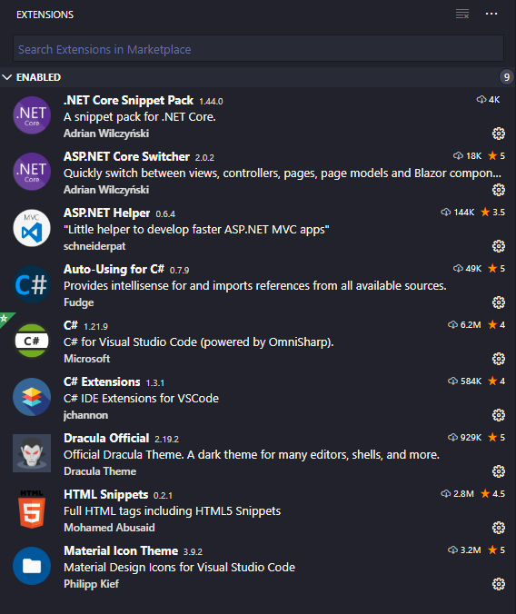

##

# O que é MVC?
**MVC** é o acrônimo de *Model-View-Controller* (em português: Arquitetura *Modelo-Visão-Controle*) é um padrão de projeto de software, ou padrão de arquitetura de software formulado na década de 1970, focado no reuso de código e a separação de conceitos em três camadas interconectadas, onde a apresentação dos dados e interação dos usuários *`front-end`* são separados dos métodos que interagem com o banco de dados *`back-end`*. [Wikipedia](https://pt.wikipedia.org/wiki/MVC).

**MVC** é nada mais que um padrão de arquitetura de software, separando sua aplicação em 3 camadas. A camada de interação do usuário(***view***), a camada de manipulação dos dados(***model***) e a camada de controle(***controller***). [Tableless](https://tableless.com.br/mvc-afinal-e-o-que/).

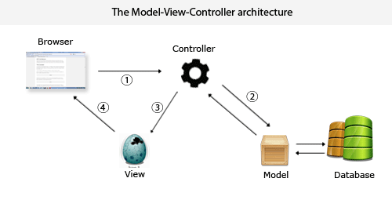

## Model

Sempre que você pensar em manipulação de dados, pense em model. Ele é responsável pela **leitura** e **escrita de dados**, e também de suas **validações**. [Tableless](https://tableless.com.br/mvc-afinal-e-o-que/).

## View

Simples: a camada de interação com o usuário. Ela apenas faz a **exibição dos dados**, sendo ela por meio de um html ou xml.
[Tableless](https://tableless.com.br/mvc-afinal-e-o-que/).

## Controller

O responsável por **receber** todas as **requisições do usuário**. Seus métodos chamados *actions* são responsáveis por uma página, controlando qual `model` usar e qual `view` será mostrado ao usuário.
[Tableless](https://tableless.com.br/mvc-afinal-e-o-que/).

##

# Um pouco de *Command Line Interface*
Usando um **terminal** que pode ser `cmd`, `PowerShell`, `Git Bash` ou outro da sua escolha, a primeira coisa a se fazer é escolher o nosso *template*, o **dotnet** nos disponibiliza vários modelos. Para visualizar esses modelos bastar digitar no terminal
```bash
dotnet new
```
Como resultado teremos obteremos:
```bash
Templates                                         Short Name               Language          Tags
----------------------------------------------------------------------------------------------------------------------------------
Console Application                               console                  [C#], F#, VB      Common/Console
Class library                                     classlib                 [C#], F#, VB      Common/Library
WPF Application                                   wpf                      [C#]              Common/WPF
WPF Class library                                 wpflib                   [C#]              Common/WPF
WPF Custom Control Library                        wpfcustomcontrollib      [C#]              Common/WPF
WPF User Control Library                          wpfusercontrollib        [C#]              Common/WPF
Windows Forms (WinForms) Application              winforms                 [C#]              Common/WinForms
Windows Forms (WinForms) Class library            winformslib              [C#]              Common/WinForms
Worker Service                                    worker                   [C#]              Common/Worker/Web
Unit Test Project                                 mstest                   [C#], F#, VB      Test/MSTest
NUnit 3 Test Project                              nunit                    [C#], F#, VB      Test/NUnit
NUnit 3 Test Item                                 nunit-test               [C#], F#, VB      Test/NUnit
xUnit Test Project                                xunit                    [C#], F#, VB      Test/xUnit
Razor Component                                   razorcomponent           [C#]              Web/ASP.NET
Razor Page                                        page                     [C#]              Web/ASP.NET
MVC ViewImports                                   viewimports              [C#]              Web/ASP.NET
MVC ViewStart                                     viewstart                [C#]              Web/ASP.NET
Blazor Server App                                 blazorserver             [C#]              Web/Blazor
ASP.NET Core Empty                                web                      [C#], F#          Web/Empty
ASP.NET Core Web App (Model-View-Controller)      mvc                      [C#], F#          Web/MVC
ASP.NET Core Web App                              webapp                   [C#]              Web/MVC/Razor Pages
ASP.NET Core with Angular                         angular                  [C#]              Web/MVC/SPA
ASP.NET Core with React.js                        react                    [C#]              Web/MVC/SPA
ASP.NET Core with React.js and Redux              reactredux               [C#]              Web/MVC/SPA
Razor Class Library                               razorclasslib            [C#]              Web/Razor/Library/Razor Class Library
ASP.NET Core Web API                              webapi                   [C#], F#          Web/WebAPI
ASP.NET Core gRPC Service                         grpc                     [C#]              Web/gRPC
dotnet gitignore file                             gitignore                                  Config
global.json file                                  globaljson                                 Config
NuGet Config                                      nugetconfig                                Config
Dotnet local tool manifest file                   tool-manifest                              Config
Web Config                                        webconfig                                  Config
Solution File                                     sln                                        Solution
Protocol Buffer File                              proto                                      Web/gRPC
```
Como mencionado vamos desenvolver `do zero`, para isso precisaremos de um *template* vazio, então vamos utilizar o modelo `ASP.NET Core Empty` que tem como *short name* `web`.

Novamente no **terminal** vamos digitar
```bash
dotnet new web -o app-mvc
```
> ***-o app-mvc*** indica a pasta do nosso projeto!

Agora vamos abrir o nosso projeto no **Visual Studio Code**. Basta digitar no terminal
```bash
code .
```

## Mãos no *Visual Studio Code*

Com o VS Code aberto vamos criar os 3 pastas do **MVC** `Models` `Views` `Controllers`. Por conversão criamos as pastas no *`Plural`*, aconselho a seguirmos essa conversão. 

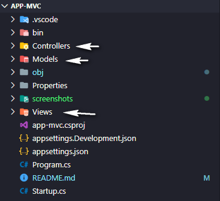

Agora vamos criar a primeiro *Controller* chamada `HomeController.cs` que ficará dentro da pasta ***Controllers*** que acabamos de criar.
> A classe ***HomeController*** herda da classe base `Controller`. Para que funcione devemos a *diretiva* *`using Microsoft.AspNetCore.Mvc;`*

Com isso nossa **`HomeController`** deverá ter o seguinte código

```c#
using Microsoft.AspNetCore.Mvc;

namespace app_mvc.Controllers
{
    public class HomeController:Controller
    {
        public ActionResult Index()
        {
            return View();
        }
    }
}
```
Agora chegou a vez de criarmos nossa *View* e se chamará `Index.cshtml` e ficará dentra da pasta ***Views > Home***.

Vamos adicionar uns códigos
```html
@{
    ViewData["Title"] = "Index";
}

<h1>Nossa Primeira View</h1>
```
Chegou a hora de vermos os resultados no navegador :rocket:. Esperamos que apareça a frase
"**Nossa Primeira View**".


 Para que isso aconteça vamos rodar a aplicação, no **terminal** vamos digitar
```bash
dotnet run
```
> O ***dotnet*** nos disponibilizou a seguinte *Url*: [`http://localhost:5000/`](http://localhost:5000/).

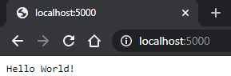

*what this is???* :scream:

### Configurando as rotas

Nossa execução não funcionou como o esperado porque não configuramos as rota da aplicação :sweat_smile:


Então vamos configurar. 

Abra o arquivo chamado ***Startup.cs*** e no método *ConfigureServices* vamos adicionar o serviço do ***`MVC`***. O método deverá ficar assim 
```c#
 public void ConfigureServices(IServiceCollection services)
  {
    services.AddControllersWithViews();
  }
```

Vamos adicionar a rota, método *Configure* vamos trocar 
```c#
app.UseEndpoints(endpoints =>
{
    endpoints.MapGet("/", async context =>
    {
      await context.Response.WriteAsync("Hello World!");
    });
}); 
```
Por 
```c#
app.UseEndpoints(endpoints =>
 {
    endpoints.MapControllerRoute(
    name: "default",
    pattern: "{controller=Home}/{action=Index}/{id?}");
  });
```
Com isso nosso arquivo ***Startup.cs*** ficará com código abaixo:

```c#
using Microsoft.AspNetCore.Builder;
using Microsoft.AspNetCore.Hosting;
using Microsoft.Extensions.DependencyInjection;
using Microsoft.Extensions.Hosting;

namespace app_mvc
{
    public class Startup
    {
        // This method gets called by the runtime. Use this method to add services to the container.
        // For more information on how to configure your application, visit https://go.microsoft.com/fwlink/?LinkID=398940
        public void ConfigureServices(IServiceCollection services)
        {
            services.AddControllersWithViews();
        }

        // This method gets called by the runtime. Use this method to configure the HTTP request pipeline.
        public void Configure(IApplicationBuilder app, IWebHostEnvironment env)
        {
            if (env.IsDevelopment())
            {
                app.UseDeveloperExceptionPage();
            }

            app.UseRouting();

            app.UseEndpoints(endpoints =>
            {
                endpoints.MapControllerRoute(
                    name: "default",
                    pattern: "{controller=Home}/{action=Index}/{id?}"
                );
            });
        }
    }
}

```
Vamos rodar novamente nossa aplicação digitando *`dotnet run`* no terminal e acessando o *link*: [`http://localhost:5000/`](http://localhost:5000/).

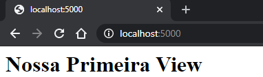

*Glória a Deuuuuss???* :raised_hands:

# Layouts

### O que é um layout

A maioria dos aplicativos Web tem um layout comum que fornece aos usuários uma experiência consistente durante sua navegação de uma página a outra. O layout normalmente inclui elementos comuns de interface do usuário, como o cabeçalho do aplicativo, elementos de menu ou de navegação e rodapé. [Por Steve Smith e Dave Brock](https://docs.microsoft.com/pt-br/aspnet/core/mvc/views/layout?view=aspnetcore-3.1).


Estruturas HTML comuns, como scripts e folhas de estilo, também são usadas com frequência por muitas páginas em um aplicativo. Todos esses elementos compartilhados podem ser definidos em um arquivo de layout, que pode então ser referenciado por qualquer página usada no aplicativo. Os layouts reduzem o código duplicado nas página. Por convenção, o layout padrão de um aplicativo ASP.NET Core é chamado *`_Layout.cshtml`*, e segue o modelo abaixo:

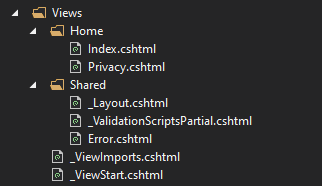

### Criando nossa *_Layout.cshtml*

Agora vamos criar nossa *layout* e ficará dentro da pasta **Views > Shared** e terá o código abaixo:

```html
<!DOCTYPE html>
<html lang="en">
<head>
    <meta charset="utf-8" />
    <meta name="viewport" content="width=device-width, initial-scale=1.0" />
    <title>@ViewData["Title"] - app-mvc</title>
    <link rel="stylesheet" href="~/lib/bootstrap/dist/css/bootstrap.min.css" />
</head>
<body>
    <header>
        <nav class="navbar navbar-expand-lg navbar-light bg-light">
                <a class="navbar-brand" asp-area="" asp-controller="Home" asp-action="Index">app-mvc</a>
                <button class="navbar-toggler" type="button" data-toggle="collapse" data-target=".navbar-collapse" aria-controls="navbarSupportedContent"
                        aria-expanded="false" aria-label="Toggle navigation">
                    <span class="navbar-toggler-icon"></span>
                </button>
                <div class="navbar-collapse collapse d-sm-inline-flex flex-sm-row-reverse">
                    <ul class="navbar-nav flex-grow-1">
                        <li class="nav-item">
                            <a class="nav-link text-dark" asp-area="" asp-controller="Home" asp-action="Index">Home</a>
                        </li>
                        <li class="nav-item">
                            <a class="nav-link text-dark" asp-area="" asp-controller="Home" asp-action="Privacy">Privacy</a>
                        </li>
                    </ul>
                </div>
        </nav>
    </header>
    <div class="container">
        <main role="main" class="pb-3">
            @RenderBody()
        </main>
    </div>

    <footer class="border-top footer text-muted">
        <div class="container">
            &copy; 2020 - app-mvc - <a asp-area="" asp-controller="Home" asp-action="Privacy">Privacy</a>
        </div>
    </footer>
    <script src="~/lib/jquery/dist/jquery.min.js"></script>
    <script src="~/lib/bootstrap/dist/js/bootstrap.bundle.min.js"></script>
    @RenderSection("Scripts", required: false)
</body>
</html>

```
 
## Especificando um layout - ViewStart.cshtml

O mecanismo de exibição Razor no MVC possui uma convenção na qual ele procura qualquer arquivo com o nome *`_ViewStart.cshtml`* e executa o código dentro desse arquivo antes de executar o código em uma página individual esse arquivo normalmente é colocado diretamente na pasta **Views**.

Vamos criar nossa *`_ViewStart.cshtml`* na pasta **Views** com o código abaixo:

```html
@{
    Layout = "_Layout";
}
```

Ao rodarmos nossa aplicação digitando *`dotnet run`* no terminal e acessando o *link*: [`http://localhost:5000/`](http://localhost:5000/), notamos que funcionou como o esperado.

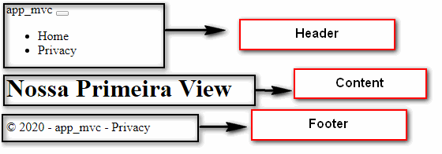


## Cascading Style Sheets - CSS

***Cascading Style Sheets (CSS)*** que traduzido para o português, significa *`Folha de Estilo em Cascatas`* é um mecanismo para adicionar estilo (cores, fontes, espaçamento, etc.) a um documento web, deixando assim nossas páginas com as aparências mais atraentes.


Ao invés de criarmos um arquivo *`css`* e customizarmos todas as *tags* uma por uma, podemos utilizar um [Framework](https://pt.wikipedia.org/wiki/Framework) que nos ajudará nessa missão, estou falando do [Bootstrap ](https://getbootstrap.com/) que é o framework mais utilizado para criar layouts e páginas de sistemas web, dashboards, sites responsivos e sites comuns, também. Ele facilita muito o trabalho de front-end.

## Bootstrap no AspNetCore

Vou utilizar a versão 4.4 do *Bootstrap* e para fazer o *download* [clique aqui](https://getbootstrap.com/docs/4.4/getting-started/download/).

Por convensão os arquivos externos ficam dentro da pasta ***wwwroot > lib > {biblioteca/framework} > dist*** 
> * Em nosso caso substituiremos `{biblioteca/framework}` por `bootstrap` 

Nossa estrutura ficará assim:
> css
> * *`wwwroot > lib > bootstrap > dist > css`*
>>  Vamos adicionar na pasta `css` apenas o arquivo ***bootstrap.min.css***

> js
> * *`wwwroot > lib > bootstrap > dist > js`*
>> E na pasta `js` adicionaremos apenas o arquivo ***bootstrap.bundle.min.js***

Para que as funcionalidades do arquivo ***bootstrap.bundle.min.js*** executem sem maiores problemas precisaremos incluir também a biblioteca `JavaScript` [jQuery](https://jquery.com/).
> Temos que criar a pasta **jquery** em ***wwwroot > lib***

 para fazer o download da versão 3.4.1 [clique aqui](https://code.jquery.com/jquery-3.4.1.min.js) e salve em: 
 >*`wwwroot > lib > jquery > dist`* com o nome ***jquery.min.js***

 As estruturas de pastas devem ficar assim:

 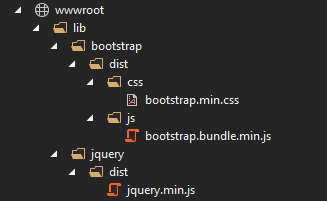

 Ao rodarmos nossa aplicação digitando *`dotnet run`* no terminal e acessando o *link*: [`http://localhost:5000/`](http://localhost:5000/), notamos que nada aconteceu:
##
  
##
  Com o nosso navegador aberto em [`http://localhost:5000/`](http://localhost:5000/), clicando com o botão direto do mouse em *`Inspecionar`* e depois na *aba* *`Console`* percebemos que temos o erro  **404 - not found** ou seja *não encontrado*:
##
  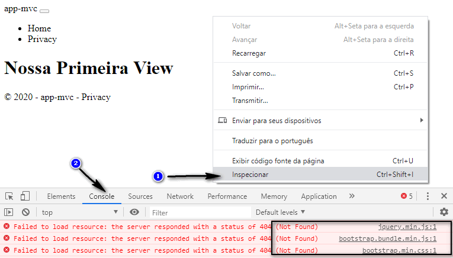
##
  Precisamos *"dizer"* para o ***dotnet*** que queremos usar `arquivos estáticos`. Para isso vamos abrir nosso arquivo ***Startup.cs*** e no método  *Configure* vamos adicionar a configuração `app.UseStaticFiles();`.
  
  O método  *Configure*  ficará da seguinte forma:

  ```c#
  public void Configure(IApplicationBuilder app, IWebHostEnvironment env)
   {
     if (env.IsDevelopment())    
      {
       app.UseDeveloperExceptionPage();
      }

     app.UseRouting();
     app.UseStaticFiles();

     app.UseEndpoints(endpoints =>
      {
        endpoints.MapControllerRoute(
        name: "default",
        pattern: "{controller=Home}/{action=Index}/{id?}");
     });
    }
  ```
  Vamos rodar nossa aplicação digitando *`dotnet run`* no terminal e acessando o *link*: [`http://localhost:5000/`](http://localhost:5000/). O resultado é fantástico! :muscle::sunglasses:

 
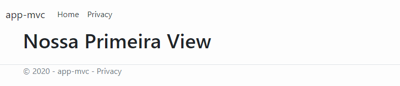


# TagHelpers

Perceba que se tentarmos navegar clicando nos *links* no nosso menu nada acontece, para isso precisamos utilizar as  ***`TagHelpers`***.

As ***TagHelpers*** são componentes reutilizáveis para automatizar a geração de HTML na Razor Pages, e não estão disponíveis para a página por padrão, são ativados adicionando uma diretiva *`@addTagHelper`* à página ou, geralmente, a um arquivo   ***_ViewImports.cshtml***.

### Habilitando TagHelpers

Vamos criar nossa *`_ViewImports.cshtml`* na pasta **Views** com o código abaixo:

```html
@addTagHelper *, Microsoft.AspNetCore.Mvc.TagHelpers
```
A diretiva *`@addTagHelper`* é seguida por um caractere `(*)` para especificar que todas *TagHelper* encontrados no assembly especificado devem ser usados e, em seguida, é fornecido o nome do assembly que contém as *TagHelper*.
> `Microsoft.AspNetCore.Mvc.TagHelpers` é o assembly que contém  ***TagHelper***.

Para saber mais, acesse a documentação oficial [clicando aqui](https://docs.microsoft.com/pt-br/aspnet/core/mvc/views/tag-helpers/intro?view=aspnetcore-3.1).

# Models

### O que é Model? 
Segundo o [Portal GSTI](https://www.portalgsti.com.br/2017/08/padrao-mvc-arquitetura-model-view-controller.html):
* É responsável pela comunicação com o banco de dados.
* É a camada que contém a estrutura de dado atrás de uma parte específica da aplicação.
* Responsável pela leitura manipulação e validação de dados, e também de suas validações.
* Responsável por tratar as regras de negócio. 
* Obtém os dados e os traduz em informações relevantes para serem exibidas pela View.
* Notifica a view e controler associados quando há uma mudança em seu estado.

## Criando Model *Aluno*

A Model ***Aluno*** não seguirá nenhum `Padrão de Projeto`*`(Design Patterns)`* pois se tratado de um exemplo de nível **básico**. Porém, se tem interresse em saber mais, recomendo:
* [eBook de Design Patterns](https://www.fabiosilvalima.net/design-patterns-vol-1/) `FREE`
* [Use a Cabeça! Padrões de Projetos](https://www.amazon.com.br/Cabe%C3%A7a-Padr%C3%B5es-Projetos-Eric-Freeman/dp/8576081741/ref=sr_1_1?__mk_pt_BR=%C3%85M%C3%85%C5%BD%C3%95%C3%91&keywords=Use+a+Cabe%C3%A7a%21+Padr%C3%B5es+de+Projetos&qid=1579186619&s=books&sr=1-1) `PAGO`

Agora ***mão no código***, primeiramente criaremos uma *controller* ***`AlunoController.cs`*** na pasta **Controllers**. Incluíremos um *método* publico do tipo `IActionResult` com o nome **Index** que retornará todos os alunos cadastrados.
```c#
using Microsoft.AspNetCore.Mvc;

namespace app_mvc.Controllers
{
    public class AlunoController : Controller
    {
        // GET: Alunos
        public IActionResult Index()
        {
            
            return View();
        }
    }
}
```
### Model *Aluno*

**Models** nada mais é do um classe, com isso em mente criaremos nossa `classe` ***Aluno.cs*** na pasta **Models** que seguirá o [diagrama de classe](https://pt.wikipedia.org/wiki/Diagrama_de_classes) abaixo:

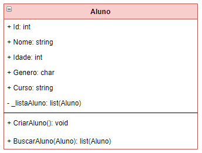

O Código:

```c#
using System;
using System.Collections.Generic;
using System.Linq;
using System.Threading.Tasks;

namespace app_mvc.Models
{
    public class Aluno
    {
        public int Id { get; set; }
        public string Nome { get; set; }    
        public int Idade { get; set; }
        public char Genero { get; set; }
        public string Curso { get; set; }
        private List<Aluno> _listaAluno;
    }
}
```

Como não farei uma comunicação com o *Banco de Dados*, vou criar o *método* ***CriarAluno*** manualmente.
```c#
public void CriarAluno()
{
  try
  {
    _listaAluno = new List<Aluno>()
    {
        new Aluno(){ Id = 1,Nome= "Paulo",Idade=29, Genero = 'M', Curso="Ciência da Computação"},
        new Aluno(){ Id = 2,Nome= "Alexandre",Idade=20, Genero = 'M', Curso="Economia"},
        new Aluno(){ Id = 3,Nome= "Carlos",Idade=25, Genero = 'M', Curso="Ciências Contábeis"},
        new Aluno(){ Id = 4,Nome= "Bianca",Idade=25, Genero = 'F', Curso="Ciência da Computação"},
        new Aluno(){ Id = 5,Nome= "Laura",Idade=35, Genero = 'F', Curso="Literatura"}
    };
   }
    catch (System.Exception ex)
    {
          
        throw new Exception(ex.Message);
    }
}
```
> Destacando que pelo `Design Patterns` deveriamos ter uma `Classe` que implementaria uma `Interface` de ***Aluno***.

Criaremos o *método* **BuscarAluno** na *Classe* **Aluno** que retorna uma *`lista de Aluno`*:
```c#
public List<Aluno> BuscarAluno()
{
    try
    {
     return _listaAluno;
    }
    catch (System.Exception ex)
    {
     throw new Exception(ex.Message);
    }
}
``` 

**Maravilha!!!** :ok_hand:

Voltando para *Controller* **AlunoController.cs** no método ***Index*** vamos fazer com que esse método use nossa *Model* **Aluno**.
Primeiro use a diretiva `using app_mvc.Models;` e depois altere o método **Index** para o código abaixo:
```c#
// GET: Alunos
public IActionResult Index()
{
    Aluno _aluno = new Aluno();  
    _aluno.CriarAluno();

    return View(_aluno.BuscarAluno());
}
```
> Mais uma recomendação do `Design Patterns` para nosso código acima seria usar [Injeção de Dependência](https://www.devmedia.com.br/design-patterns-injecao-de-dependencia-com-csharp/23671).

## Criando a View *Index* do *AlunoController*

Criaremos a ***Index.cshtml*** dentro da *pasta* ***Views > Aluno*** como o código abaixo:

```html
@model IEnumerable<app_mvc.Models.Aluno>

@{
    ViewData["Title"] = "Aluno";
}

<div class="jumbotron jumbotron-fluid text-center">
  <div class="container">
    <h1 class="display-4">Aluno</h1>
    <p class="lead">Aqui vemos o resultado da implementação da <i>Model</i> <strong>Aluno</strong>.</p>
  </div>
</div>
<div class="container">
    <table class="table table-striped">
  <thead class="thead-dark">
    <tr>
      <th scope="col">Código</th>
      <th scope="col">Nome</th>
      <th scope="col">Idade</th>
      <th scope="col">Sexo</th>
      <th scope="col">Curso</th>
    </tr>
  </thead>
  <tbody>
      @foreach (var aluno in Model)
      {
        <tr>
            <td>@aluno.Id</td>
            <td>@aluno.Nome</td>
            <td>@aluno.Idade</td>
            <td>@aluno.Genero</td>
            <td>@aluno.Curso</td>
        </tr>
      }
   
  </tbody>
    </table>
</div>
```
### Adicionando um link na *Layout*

Adicionaremos uma *ação* para que possamos acessar a nossa página. Na ***_Layout.cshtml*** modificaremos o código que direciona para a **View** ***`Privacy`*** que não estamos usando. O código ficará assim:

```html
 <li class="nav-item">
    <a class="nav-link text-dark" asp-area="" asp-controller="Aluno" asp-action="Index">Aluno</a>
 </li>
```

## Resultado Final

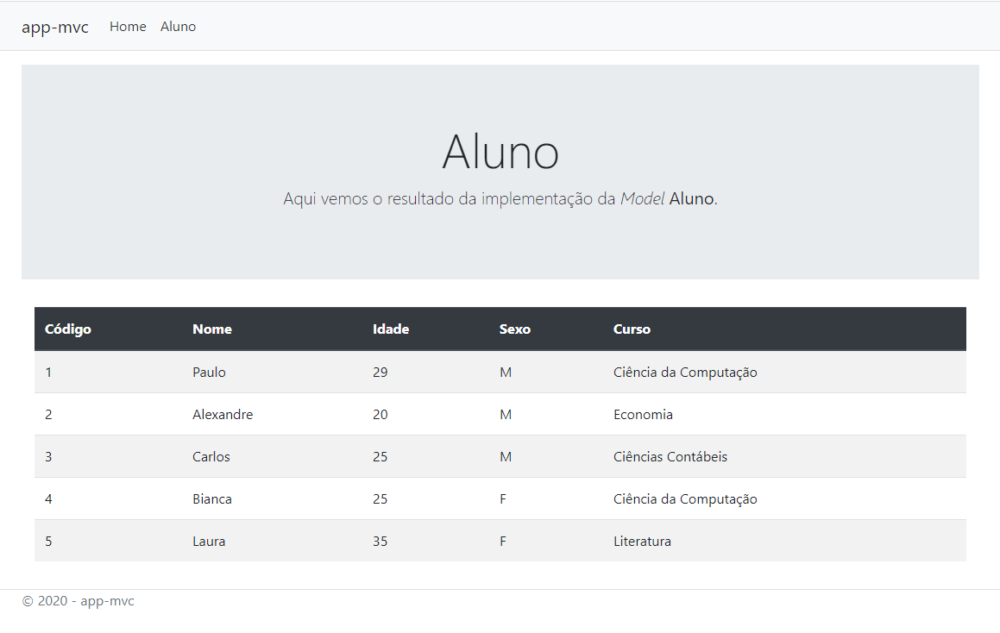


